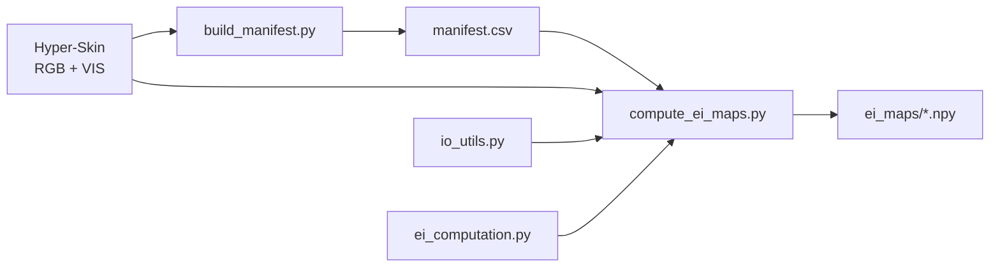
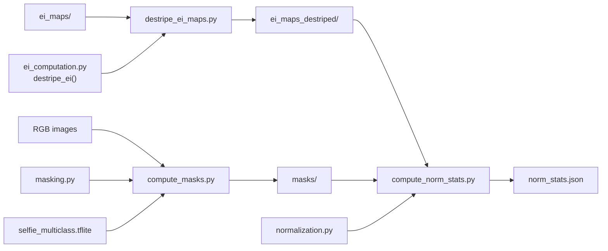
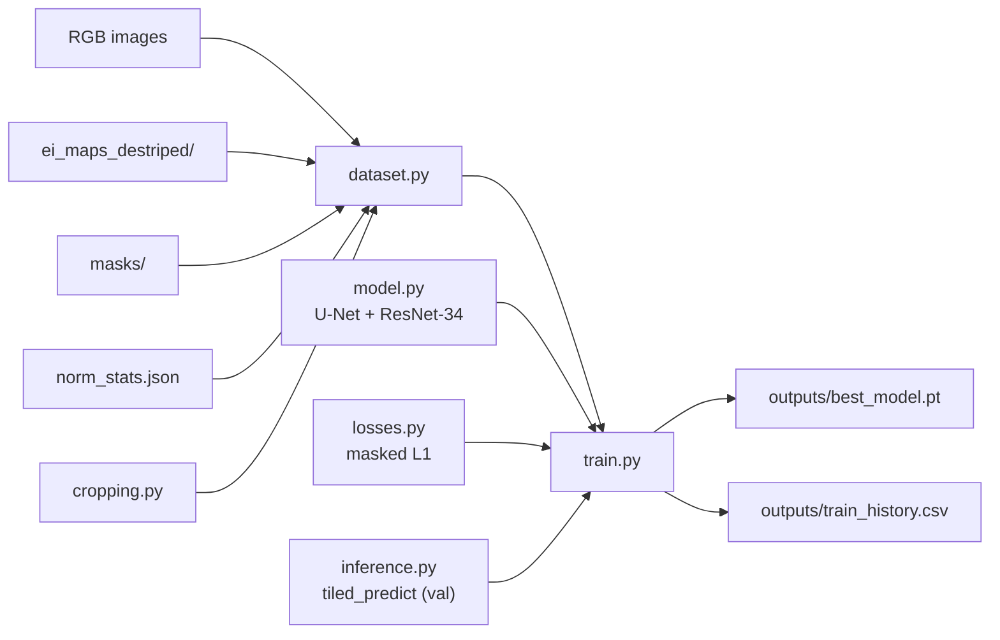
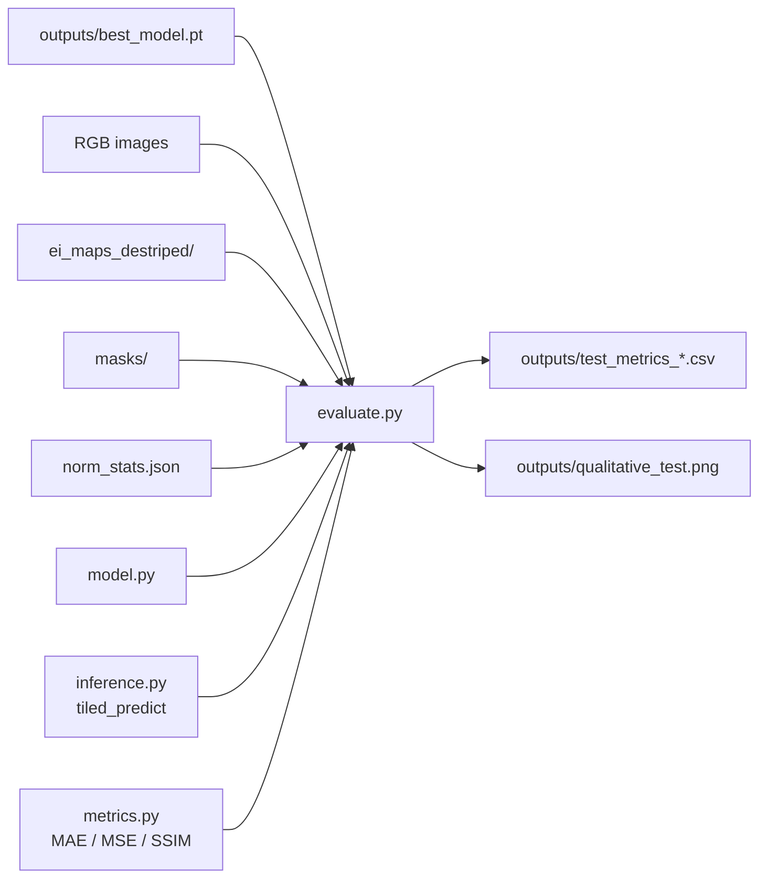

## Estimating Facial Skin Erythema from RGB Images Using Hyperspectral Imaging Data
#### Bachelor Thesis

---

### Project overview

A system for estimating erythema index maps from RGB images, that represents the following pipeline:  
  
- **Computation of erythema index maps:** Erythema index (EI) maps are derived using the Dawson Erythema Index (DEI) formula applied to hyperspectral cubes.
- **Data preprocessing:** The images undergo destriping (of the EI maps), normalization, and masking of the facial region.
- **Training a model to predict erythema index maps:** a U-Net encoder–decoder architecture performs pixel-wise regression of EI maps from RGB input, supervised by the ground-truth EI maps.
- **Model Evaluation:** Quantitative metrics MAE, MSE, and SSIM assess the model's feasibility on unseen subjects.
- **Visualization:** Artifacts are produced showing the ground-truth data alongside the estimated EI maps and an error map.  
  
The objective of the project is to assess the feasibility of the produced system for predicting EI maps from RGB input 
and target EI maps, derived from hyperspectral data.   

---

### Dataset Description

The **Hyper-Skin 2023** dataset is the data source used in this project:
```bibtex
@inproceedings{ng2023hyperskin,
  title={Hyper-Skin: A Hyperspectral Dataset for Reconstructing Facial Skin-Spectra from {RGB} Images},
  author={Pai Chet Ng and Zhixiang Chi and Yannick Verdie and Juwei Lu and Konstantinos N Plataniotis},
  booktitle={Thirty-seventh Conference on Neural Information Processing Systems Datasets and Benchmarks Track},
  year={2023},
  url={https://openreview.net/forum?id=doV2nhGm1l}
}
```    
  
The utilized data includes RGB-VIS image pairs of participants' faces:    
- RGB images
- Hyperpsectral cubes of the visual spectrum, spanning the 400-700 nm range. 
  
The dataset includes 51 subjects, resulting in 306 paired hyperspectral cubes and RGB images.      
The dataset is partitioned into **train, validation, and test splits**.   
> **Train split**: 44 subjects / 264 RGB-VIS pairs   
> **Validation split**: 3 subjects / 18 RGB-VIS pairs  
> **Test split**: 4 subjects / 24 RGB-VIS pairs      
  
Each split contains **6 images per subject**, covering:  
> - **3 views**: front, right, and left     
> - **2 poses**: neutral and smile   
  
The dataset is organized as:  
```  
Hyper-Skin(RGB, VIS)/       
    train/
        RGB/    p{xxx}_{pose}_{view}.jpg
        VIS/    p{xxx}_{pose}_{view}.mat
    test/
        RGB/    p{xxx}_{pose}_{view}.jpg
        VIS/    p{xxx}_{pose}_{view}.mat
    valid/
        RGB/    p{xxx}_{pose}_{view}.jpg
        VIS/    p{xxx}_{pose}_{view}.mat  
```  
-  **p{xxx}**: subject ID, e.g., `p012`   
-  **{pose}**: pose of the subject in the image, e.g., `neutral`/`smile`  
-  **{view}**: view of the subject in the image, e.g., `front`/`left`/`right` 

---

### Dataset access 

The Hyper-Skin dataset and all derived data is subject to an EULA (End User 
License Agreement) and **cannot be included in or distributed from this repository**.  
To reproduce this repository, follow the `Usage Instructions` on how to access the dataset and 
and run the pipeline. 

---  
### System Pipeline

#### Stage 1: Ground-truth EI map computation

**Scripts:**
- `scripts/build_manifest.py` — scans the dataset folders and writes the manifest (one row per image: subject, pose, view, split, file paths).
- `scripts/compute_ei_maps.py` — batch-computes the raw Dawson EI map for every image from its VIS cube.



Dawson erythema index (DEI) formula is applied:

```
DEI = 100 × [r + (3/2)(q + s) − 2(p + t)]
```
  
where p, q, r, s, t = log₁₀(1 / R) at 510, 540, 560, 580, 610 nm respectively.

- The five wavelengths map to five bands of the hyperspectral cube (31 bands, 400–700 nm, 10 nm step).
- Reflectance R is read per band and converted to log-reciprocal reflectance.
- Applied independently to every pixel → one 1024×1024 EI map per image.

---

#### Stage 2: Data preprocessing

Data preprocessing is conducted in three steps: EI map destriping, normalization, mask computation.

**Scripts:**
- `scripts/destripe_ei_maps.py` — batch-destripes the raw EI maps into the model target (offline, no cubes).
- `scripts/compute_masks.py` — batch-computes the binary face-skin mask for every RGB image.
- `scripts/compute_norm_stats.py` — computes the EI normalization percentiles from train-split skin pixels.


---

#### Stage 3 — Model training

**Scripts:**
- `scripts/train.py` — trains the U-Net on RGB input and EI maps target. Runs validation and minimizes the loss function.
Saves the best model weights and per-epoch loss and validation MAE metrics. 



- **Model:** U-Net with a ResNet-34 encoder pretrained on ImageNet (via `segmentation_models_pytorch`),
  single-channel sigmoid output in [0, 1]. Built by `src/model.py`.
- **Input/target:** ImageNet-standardised RGB in, normalised destriped EI out. Applying **masked L1 loss** on
  skin pixels only.
- **Training patches:** for memory constraints, each sample is a **mask-guided
  random 256×256 crop** with applied geometric augmentation (random horizontal flip).
- **Validation:** each epoch predicts whole 1024×1024 images by **tiling** (`src/inference.py`) and
  scores **per-image masked MAE** (the same metric and aggregation used at evaluation). The best model with lowest
  validation MAE is kept, with early stopping.
- **Outputs:** `outputs/best_model.pt`, `outputs/train_history.csv`.

---

#### Stage 4: Evaluation

**Scripts:**
- `scripts/evaluate.py` — loads the best model weights, predicts the test split by tiling, and writes masked MAE/MSE/SSIM tables + the qualitative figure.



- **Metrics** are computed over **skin pixels only** (mask==1), per image, then reported as mean ± std,
  stratified by view and pose. 
- **Tables:** `test_metrics_per_subject.csv`, `test_metrics_per_view&pose.csv`, `test_metrics_aggregate.csv`.
- **Figure:** `qualitative_test.png` — RGB / Ground-truth EI / Predicted EI / Error map panels for permitted subjects.

---

### Usage Instructions

**1. Request dataset access** at https://hyperskinsiteapp--hyperskinwebapp.asia-east1.hosted.app/dataAccess. After approval you will receive a password by email and `Hyper-Skin.7z` will be shared with your Google account on Google Drive.

**2. Install dependencies** (requires Python 3.12)
```bash
pip install -r requirements.txt
brew install p7zip      # macOS — provides the 7z extraction tool
brew install rclone     # macOS — used to download the dataset from Google Drive
```

> The `brew` commands are macOS-only. On Linux, install the same tools with your package manager (e.g. `apt install p7zip-full rclone`).

**3. Set up rclone Google Drive remote**

rclone authenticates with your Google account to download the dataset. Run the interactive setup:
```bash
rclone config
```

A browser window pops up for Google sign-in — log in, click Allow, then return to the terminal to finish the remaining prompts.

At the prompts, follow the steps:

| Prompt                  | What to enter |
|-------------------------|---------------|
| New remote              | `n` |
| Name                    | any name, e.g. `gdrive_thesis` — used later in `.env` |
| Storage type            | type `drive` (or the number shown for Google Drive — e.g. `22`) |
| client_id               | press Enter (leave blank) |
| client_secret           | press Enter (leave blank) |
| scope                   | `2` (read-only) |
| service_account_file    | press Enter (leave blank) |
| Edit advanced config    | `n` |
| Use web browser         | `y` — a browser window opens, log in with the Google account that has dataset access and click Allow |
| Configure as Shared Drive | `n` |
| Keep remote             | `y` |
| Quit                    | `q` |

**4. Configure the environment**
```bash
cp .env.example .env
```

Open `.env` and fill in the values:

| Variable         | Where to find it |
|------------------|------------------|
| `HYPERSKIN_PASS` | Dataset access email — "Dataset Access Password" |
| `RCLONE_REMOTE`  | The name you chose for the rclone remote in step 3 |
| `DATA_ROOT`      | Set after extraction (step 5 prints the correct path) |

**5. Download and extract the dataset**
```bash
caffeinate -di python scripts/extract_dataset.py --output-dir /path/to/destination
```

> **On macOS:** caffeinate -di prevents from sleeping during the download  
> **On Windows:** disable sleep in Power Settings beforehand  
  
Once complete, the script prints the correct DATA_ROOT value, which is copied into .env.

**The script produces:**

```
Google Drive                       local disk (/path/to/destination)
─────────────────                  ──────────────────────────────────────────
Hyper-Skin.7z (~100 GB)            Hyper-Skin(RGB, VIS)/
  ├── Hyper-Skin(RGB, VIS)/   →      ├── train/
  │     ├── RGB/*.jpg                │     ├── RGB/*.jpg   (246 images)
  │     └── VIS/*.mat                │     └── VIS/*.mat   (246 cubes)
  └── Hyper-Skin(MSI, NIR)/          ├── test/
        [skipped — not used]         │     ├── RGB/*.jpg   (42 images)
                                     │     └── VIS/*.mat   (42 cubes)
                                     └── valid/
                                           ├── RGB/*.jpg   (18 images)
                                           └── VIS/*.mat   (18 cubes)
```

**6. Run the pipeline** (in this order — each step consumes the previous step's output)
```bash
# 1. Build the manifest (creates data/processed/manifest.csv)
python scripts/build_manifest.py

# 2. Compute raw EI maps (creates data/processed/ei_maps/*.npy)
python scripts/compute_ei_maps.py

# 3. Destripe EI maps (creates data/processed/ei_maps_destriped/*.npy; runs offline)
python scripts/destripe_ei_maps.py

# 4. Compute masks (creates data/processed/masks/*.npy;
#    auto-downloads the segmenter model to models/ on first run)
python scripts/compute_masks.py

# 5. Compute EI normalization statistics (creates data/processed/norm_stats.json)
python scripts/compute_norm_stats.py

# 6. Train the U-Net model (creates outputs/best_model.pt + train_history.csv)
python scripts/train.py

# 7. Evaluate on the test split (creates outputs/test_metrics_*.csv + qualitative_test.png)
python scripts/evaluate.py
```

**7. Notebooks (Optional)**  
Jupyter notebooks exist for exploratory analysis and documentation of results, 
divided in `notebooks/exploration` and `notebooks/results`.  
Jupyter notebooks browser is opened for accessing the notebooks by running the following command in the IDE terminal:    
```bash
jupyter notebook
```


Notebooks are committed without outputs; run them top-to-bottom to regenerate the figures.

`Disclaimer:`  
  
> This software implementation is executed using Claude Code. 
Design decisions are independently made with own research and reasoning, and realized through multiple coding iterations.