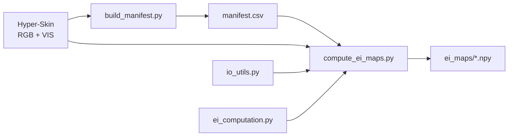
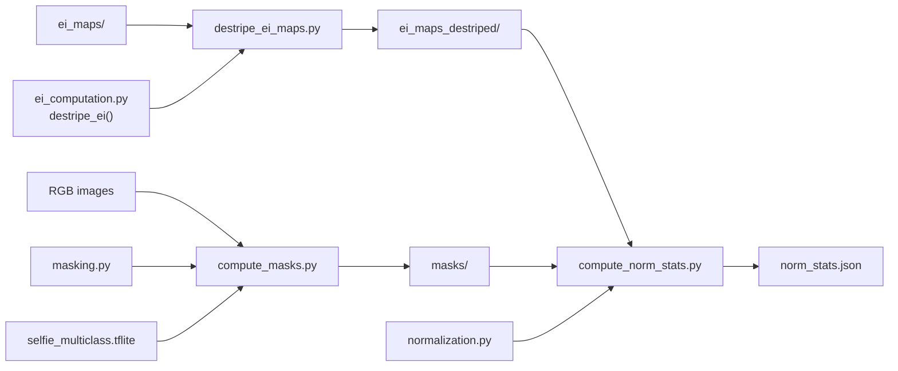
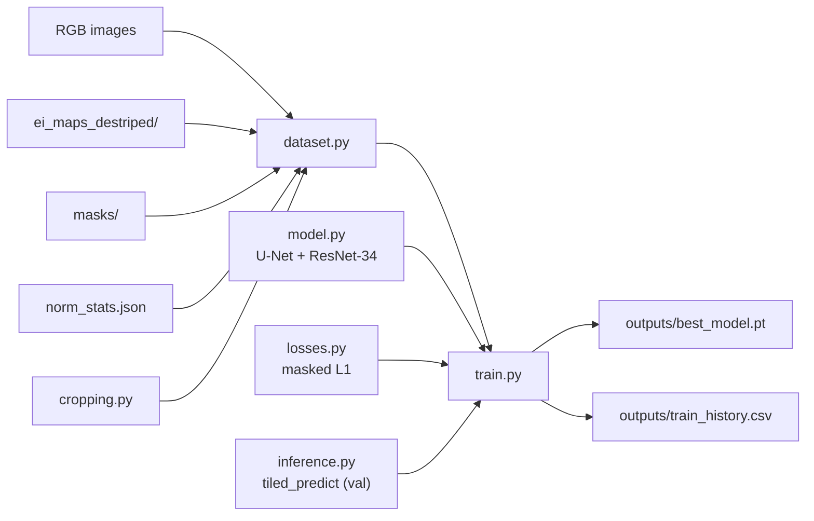
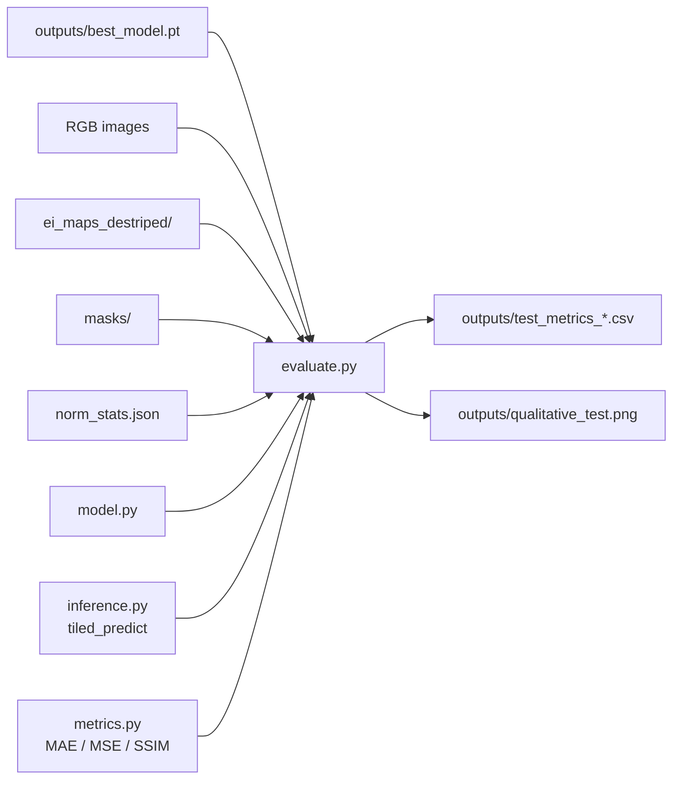

## Estimating Facial Skin Erythema from RGB Images Using Hyperspectral Imaging Data
#### Bachelor Thesis

---

### Project overview

A deep learning pipeline that learns to predict facial erythema index maps from
standard RGB photos, supervised by ground-truth maps derived from co-registered
hyperspectral VIS cubes.

---

### Dataset

The **Hyper-Skin 2023** dataset is the data source used in this project. The RGB-VIS pairs are utilized, spanning 51 subjects across 306 paired hyperspectral cubes and RGB images.

- Splits: train = 44 subjects / 264 images, test = 4 subjects / 24 images, valid = 3 subjects / 18 images.
- **Split override:** subjects p027, p019, p012 are assigned to `test` regardless of their folder, managed via `manifest.csv` (files are not moved).
- Raw cubes: ~124 MB each, ~38 GB total.

```bibtex
@inproceedings{ng2023hyperskin,
  title={Hyper-Skin: A Hyperspectral Dataset for Reconstructing Facial Skin-Spectra from {RGB} Images},
  author={Pai Chet Ng and Zhixiang Chi and Yannick Verdie and Juwei Lu and Konstantinos N Plataniotis},
  booktitle={Thirty-seventh Conference on Neural Information Processing Systems Datasets and Benchmarks Track},
  year={2023},
  url={https://openreview.net/forum?id=doV2nhGm1l}
}
```

---

### Data access and EULA

The Hyper-Skin dataset and all derived data (including erythema index maps) is subject to a dataset EULA (End User 
License Agreement) and **cannot be included in or distributed from this repository**. 
Only 3 of 51 subjects consented to publication use; the EULA restricts storage to signatories only.

**This repository ships code only — no data of any kind.**

Anyone running this pipeline must independently request access:

> **Access request form:** https://hyperskinsiteapp--hyperskinwebapp.asia-east1.hosted.app/dataAccess

After approval you will receive a download link and access password by email. The download is an
archive (`Hyper-Skin.7z`). Once extracted it contains:

```
Hyper-Skin(MSI, NIR)/       
Hyper-Skin(RGB, VIS)/       
    train/
        RGB/    p{xxx}_{facial_pose}_{direction}.jpg
        VIS/    p{xxx}_{facial_pose}_{direction}.mat
    test/
        RGB/    p{xxx}_{facial_pose}_{direction}.jpg
        VIS/    p{xxx}_{facial_pose}_{direction}.mat
    valid/
        RGB/    p{xxx}_{facial_pose}_{direction}.jpg
        VIS/    p{xxx}_{facial_pose}_{direction}.mat
```

Filenames follow `p{xxx}_{facial_pose}_{direction}`: `p{xxx}` = subject (e.g. `p012`),
`{facial_pose}` ∈ {`neutral`, `smile`}, `{direction}` ∈ {`front`, `left`, `right`}. Each RGB
`.jpg` and its paired VIS `.mat` share the same stem (e.g. `p012_neutral_left`).

---

### Repository structure

```
erythema-estimation/
├── config.py                         # All paths, constants, hyperparameters
├── .env                              # Your local DATA_ROOT (gitignored)
├── .env.example                      # Template — copy to .env and fill in
├── src/
│   ├── manifest.py                   # Build/load dataset manifest CSV
│   ├── io_utils.py                   # Load .mat cubes and .jpg RGB images
│   ├── ei_computation.py             # Dawson EI formula + destriping + batch computation
│   ├── masking.py                    # Face-skin mask from RGB (MediaPipe segmenter)
│   ├── normalization.py              # RGB/EI normalisation + stats save/load
│   ├── cropping.py                   # Mask-guided random crop helpers (pure NumPy)
│   ├── dataset.py                    # PyTorch Dataset: RGB→EI patches / full images
│   ├── model.py                      # U-Net builder (ResNet-34 encoder) + device select
│   ├── losses.py                     # Masked L1 loss (skin pixels only)
│   ├── inference.py                  # Tiled full-image prediction
│   └── metrics.py                    # Masked MAE / MSE / SSIM
├── scripts/
│   ├── build_manifest.py             # CLI: generate data/processed/manifest.csv
│   ├── compute_ei_maps.py            # CLI: batch-compute all raw EI maps
│   ├── destripe_ei_maps.py           # CLI: batch-destripe EI maps (offline, no SSD)
│   ├── compute_masks.py              # CLI: batch-compute binary face-skin masks
│   ├── compute_norm_stats.py         # CLI: EI normalisation stats from train-skin pixels
│   ├── train.py                      # CLI: train the U-Net (RGB→EI, masked loss)
│   └── evaluate.py                   # CLI: evaluate on the test split + figures
├── notebooks/
│   ├── 01_data_exploration.ipynb     # Sanity-check data before batch run
│   ├── 01b_stripe_analysis.ipynb     # Characterise the push-broom stripe
│   ├── 01c_ei_destriping.ipynb       # Validate the destriping method
│   ├── 01d_destriping_relevance.ipynb # Destriping on the skin region (raw vs destriped)
│   ├── 02_skin_masking.ipynb         # Select + validate the masking approach
│   └── 03_normalization.ipynb        # Verify masks + normalised inputs/target
├── models/
│   └── selfie_multiclass.tflite      # Segmenter model — auto-downloaded (gitignored)
├── outputs/                          # Training + evaluation results (gitignored)
│   ├── best_model.pt                 # Best checkpoint by val MAE — train.py
│   ├── train_history.csv             # Per-epoch losses/metrics — train.py
│   ├── test_metrics_*.csv            # Test metric tables — evaluate.py
│   └── qualitative_test.png          # RGB/GT/pred/error panels — evaluate.py
└── data/
    └── processed/
        ├── manifest.csv              # Generated by build_manifest.py (gitignored)
        ├── ei_maps/                  # Raw EI maps — compute_ei_maps.py (gitignored)
        ├── ei_maps_destriped/        # Destriped EI maps — destripe_ei_maps.py (gitignored)
        ├── masks/                    # Binary face-skin masks — compute_masks.py (gitignored)
        └── norm_stats.json           # EI norm stats — compute_norm_stats.py (gitignored)
```

---

### Stage 1 — Ground-truth EI map computation

**Scripts:**
- `scripts/build_manifest.py` — scans the dataset folders and writes the manifest (one row per image: subject, pose, view, split, file paths).
- `scripts/compute_ei_maps.py` — batch-computes the raw Dawson EI map for every image from its VIS cube.



Dawson erythema index (Abdlaty et al. 2021, Eq. 3; Dawson et al. 1980):

```
DEI = 100 × [r + (3/2)(q + s) − 2(p + t)]
```

where p, q, r, s, t = log₁₀(1 / R) at 510, 540, 560, 580, 610 nm respectively.

- The five wavelengths map to five bands of the hyperspectral cube (31 bands, 400–700 nm, 10 nm step);
  reflectance R is read per band and converted to log-reciprocal reflectance (absorbance).
- Applied independently to every pixel → one 1024×1024 EI map per image.
- Background pixels come out negative — their spectra don't match the haemoglobin absorption pattern.

---

### Stage 2 — Data preprocessing

Three steps take the raw EI maps and RGB images to model-ready form: the EI target is destriped,
a face-skin mask is computed per image, and both streams are normalised.

**Scripts:**
- `scripts/destripe_ei_maps.py` — batch-destripes the raw EI maps into the model target (offline, no cubes).
- `scripts/compute_masks.py` — batch-computes the binary face-skin mask for every RGB image.
- `scripts/compute_norm_stats.py` — computes the EI normalisation percentiles from train-split skin pixels.



#### 2.1 Destriping (EI target)

- **Problem:** the log-reciprocal transform amplifies the sensor's push-broom stripe into a visible
  per-column artifact in the EI maps. The RGB images are unaffected and stay raw.
- **Method:** robust column-offset subtraction (`destripe_ei`) — one offset per column, taken from
  the column median and high-passed with a 100-px median filter, subtracted row-wise. The offset is
  estimated from the whole image (the featureless background is the clean place to read the pure
  stripe); fitting it to skin only would absorb facial structure into the offset and corrupt the target.
- **Result:** ~84% of the whole-image streaking removed (`01c`), and — the decisive check — the removed
  component is *stripe, not anatomy* (`01d`): destriping does not corrupt the erythema signal. A faint,
  value-dependent residual remains on skin (mildest there, since the stripe is weakest on skin); it is
  zero-mean target noise and does not affect the mask (validated in `01b`/`01c`/`01d`).
- Runs offline from `ei_maps/` (no cubes needed) and writes `ei_maps_destriped/` separately —
  the raw maps are kept for a raw-vs-destriped ablation. The destriped maps are the model target.

#### 2.2 Face-skin masking

- **Why:** the model is trained and evaluated on facial skin only, so every image needs a region mask.
- **Method:** from the **RGB image alone** — MediaPipe's multiclass selfie segmenter
  (`selfie_multiclass_256x256`, pinned version, auto-downloaded to `models/`), keeping the
  **face-skin class** only. Hair and background are excluded per-pixel by class; no threshold,
  morphology, or landmarks.
- **Why not EI:** no 1-D EI threshold separates skin from the dark booth background — the log
  transform pushes background values into the skin range (verified in `02_skin_masking.ipynb`).
- **Result:** one binary uint8 {0,1} mask per image in `masks/`. Validated 306/306: ~26% mean skin
  coverage, no empty, collapsed, or runaway masks across all three views.
- Masks are stored **binary and applied downstream** (masked loss, metrics, visualisation) —
  never pre-baked into the EI maps or RGB.

#### 2.3 Normalisation

Normalisation is applied on the fly by the data loader (`src/normalization.py`):

- **RGB input:** ImageNet standardisation — `(rgb/255 − mean) / std` per channel
  (`preprocess_rgb_imagenet`). The ResNet-34 encoder is pretrained on ImageNet and expects inputs
  in that space, so plain ÷255 is not used for the model input. (`normalize_rgb`, plain ÷255 → [0,1],
  is kept only for *displaying* RGB in the notebooks — ImageNet-standardised RGB has negative values
  and does not render.)
- **EI target:** robust percentile-based min-max to [0, 1] — `(ei − p1) / (p99 − p1)`, clipped to [0, 1].
- The percentiles are computed **once, from train-split skin pixels only** (destriped EI where
  mask == 1) and saved to `norm_stats.json`; the same saved statistics are applied to every split
  at load time — no test-set leakage.
- **Why skin-only + percentiles:** background EI extremes are corrupted and would stretch the scale;
  the p1/p99 cut keeps the log(1/R) outlier tails from defining it. Cost: ~1% of skin pixels clipped
  per side on all splits (verified in `03_normalization.ipynb`).
- Nothing normalised is written to disk — artifacts stay in real EI units, the two saved numbers are
  applied on the fly by the data loader, and predictions remain invertible to real EI.

**Model contract (Stage 3):** input = ImageNet-standardised RGB (full frame, unmasked) → U-Net →
normalised destriped EI map; the loss and all metrics are computed on `mask == 1` pixels only,
consistently in training and evaluation.

---

### Stage 3 — Model training

**Scripts:**
- `scripts/train.py` — trains the U-Net (RGB→EI), validates on whole images by tiling, and saves the best checkpoint + per-epoch history.



- **Model:** U-Net with a ResNet-34 encoder pretrained on ImageNet (via `segmentation_models_pytorch`),
  single-channel sigmoid output in [0, 1]. Built by `src/model.py`.
- **Input/target:** ImageNet-standardised RGB in, normalised destriped EI out; **masked L1 loss** on
  skin pixels only.
- **Training patches:** full 1024×1024 maps do not fit in memory, so each sample is a **mask-guided
  random 256×256 crop** (≥10% skin, resampled up to 20×, centroid fallback) plus a random horizontal
  flip — the same crop applied to RGB, EI, and mask together.
- **Validation:** each epoch predicts whole 1024×1024 images by **tiling** (`src/inference.py`) and
  scores masked MAE/MSE; the best checkpoint (lowest val MAE) is kept, with early stopping.
- **Device:** CUDA → MPS → CPU, chosen automatically (`get_device`).
- **Outputs:** `outputs/best_model.pt`, `outputs/train_history.csv`.

> **TODO (author):** produce the model architecture diagram, and be able to explain the underlying
> U-Net architecture (encoder / decoder / skip connections) and how the model is initialised
> (ResNet-34 ImageNet-pretrained encoder + decoder trained from scratch, via
> `segmentation_models_pytorch`).

---

### Stage 4 — Evaluation

**Scripts:**
- `scripts/evaluate.py` — loads the best checkpoint, predicts the test split by tiling, and writes masked MAE/MSE/SSIM tables + the qualitative figure.



- **Metrics** are computed over **skin pixels only** (mask==1), per image, then reported as mean ± std,
  stratified by view and pose. MAE/MSE in both EI units and normalised [0, 1]; SSIM is unitless.
- **Tables:** `test_target_ei_stats.csv` (target EI range on skin, for interpreting the errors),
  `test_metrics_per_subject.csv`, `test_metrics_per_view&pose.csv`, `test_metrics_aggregate.csv`.
- **Figure:** `qualitative_test.png` — RGB / ground-truth EI / prediction / error panels for the
  display-permitted subjects.

---

### Setup and quickstart

**1. Request dataset access** at https://hyperskinsiteapp--hyperskinwebapp.asia-east1.hosted.app/dataAccess. After approval you will receive a password by email and `Hyper-Skin.7z` will be shared with your Google account on Google Drive.

**2. Install dependencies**
```bash
pip install -r requirements.txt
brew install p7zip      # macOS — provides the 7z extraction tool
brew install rclone     # macOS — used to download the dataset from Google Drive
```

**3. Set up rclone Google Drive remote (one-time)**

rclone authenticates with your Google account to download the dataset. Run the interactive setup:
```bash
rclone config
```

Follow these steps at the prompts:

| Prompt                  | What to enter |
|-------------------------|---------------|
| New remote              | `n` |
| Name                    | any name, e.g. `gdrive_thesis` — you will use this in `.env` |
| Storage type            | `22` (Google Drive) |
| client_id               | press Enter (leave blank) |
| client_secret           | press Enter (leave blank) |
| scope                   | `2` (read-only) |
| service_account_file    | press Enter (leave blank) |
| Edit advanced config    | `n` |
| Use web browser         | `y` — a browser window opens; log in with the Google account that has dataset access and click Allow |
| Configure as Shared Drive | `n` |
| Keep remote             | `y` |
| Quit                    | `q` |

**4. Configure your environment**
```bash
cp .env.example .env
```

Open `.env` and fill in the values:

| Variable         | Where to find it |
|------------------|------------------|
| `HYPERSKIN_PASS` | Dataset access email — "Dataset Access Password" |
| `RCLONE_REMOTE`  | The name you chose for the rclone remote in step 3 |
| `DATA_ROOT`      | Set after extraction (step 5 prints the correct path) |

**5. Download and extract the dataset**
```bash
caffeinate -di python scripts/extract_dataset.py --output-dir /path/to/destination
```

> **Important:** The archive is ~100 GB and takes longer to download. It cannot be resumed if interrupted. Leave the machine plugged in overnight — `caffeinate -di` prevents macOS from sleeping. On Windows, disable sleep in Power Settings before running.

Once complete, the script prints the correct `DATA_ROOT` value — copy it into `.env`.

**What the script produces:**

```
Google Drive                       local disk (/path/to/destination)
─────────────────                  ──────────────────────────────────────────
Hyper-Skin.7z (~100 GB)            Hyper-Skin(RGB, VIS)/
  ├── Hyper-Skin(RGB, VIS)/   →      ├── train/
  │     ├── RGB/*.jpg                │     ├── RGB/*.jpg   (246 images)
  │     └── VIS/*.mat                │     └── VIS/*.mat   (246 cubes)
  └── Hyper-Skin(MSI, NIR)/          ├── test/
        [skipped — not used]         │     ├── RGB/*.jpg   (42 images)
                                     │     └── VIS/*.mat   (42 cubes)
                                     └── valid/
                                           ├── RGB/*.jpg   (18 images)
                                           └── VIS/*.mat   (18 cubes)
```

**6. Run the pipeline** (in this order — each step consumes the previous step's output)
```bash
# 1. Build the manifest (creates data/processed/manifest.csv)
python scripts/build_manifest.py

# 2. Batch-compute all raw EI maps (creates data/processed/ei_maps/*.npy)
python scripts/compute_ei_maps.py

# 3. Destripe the EI maps (creates data/processed/ei_maps_destriped/*.npy; runs offline)
python scripts/destripe_ei_maps.py

# 4. Compute face-skin masks (creates data/processed/masks/*.npy;
#    auto-downloads the segmenter model to models/ on first run)
python scripts/compute_masks.py

# 5. Compute EI normalisation statistics (creates data/processed/norm_stats.json)
python scripts/compute_norm_stats.py

# 6. Train the U-Net (creates outputs/best_model.pt + train_history.csv)
python scripts/train.py

# 7. Evaluate on the test split (creates outputs/test_metrics_*.csv + qualitative_test.png)
python scripts/evaluate.py
```

Steps 1–5 (data preprocessing) are CPU-only; steps 6–7 use PyTorch and the GPU if available
(CUDA/MPS). Every artifact under `data/processed/`, `models/`, and `outputs/` is gitignored (see
*Data access and EULA*) and fully regenerated by these steps; each script checks its prerequisites
and says what to run first if something is missing.

**8. (Optional) Notebooks** — each pipeline step has an accompanying notebook with the analysis
behind it and verification of its outputs:

```bash
jupyter lab
```

| Notebook | Run after | Shows |
|----------|-----------|-------|
| `01_data_exploration.ipynb` | step 1 | dataset sanity checks before the batch run |
| `01b_stripe_analysis.ipynb` | step 2 | characterisation of the push-broom stripe |
| `01c_ei_destriping.ipynb` | step 3 | validation of the destriping method |
| `01d_destriping_relevance.ipynb` | steps 3–4 | destriping on the skin region (raw vs destriped) |
| `02_skin_masking.ipynb` | step 4 | masking approach selection + validation |
| `03_normalization.ipynb` | step 5 | mask overlays + normalised input/target verification |

Notebooks are committed without outputs; run them top-to-bottom to regenerate the figures.
