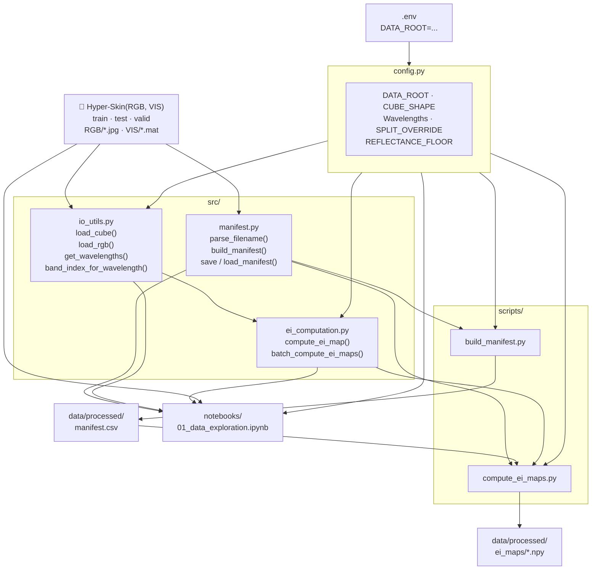

## Estimating Facial Skin Erythema from RGB Images Using Hyperspectral Imaging Data
#### Bachelor Thesis

---

### Project overview

A deep learning pipeline that learns to predict facial erythema index maps from
standard RGB photos, supervised by ground-truth maps derived from co-registered
hyperspectral VIS cubes.

---

### Dataset

The **Hyper-Skin 2023** dataset is the data source used in this project. The RGB-VIS pairs are utilized, spanning 51 subjects across 306 paired hyperspectral cubes and RGB images.

- Splits: train = 44 subjects / 264 images, test = 4 subjects / 24 images, valid = 3 subjects / 18 images.
- **Split override:** subjects p027, p019, p012 are assigned to `test` regardless of their folder, managed via `manifest.csv` (files are not moved).
- Raw cubes: ~124 MB each, ~38 GB total.

```bibtex
@inproceedings{ng2023hyperskin,
  title={Hyper-Skin: A Hyperspectral Dataset for Reconstructing Facial Skin-Spectra from {RGB} Images},
  author={Pai Chet Ng and Zhixiang Chi and Yannick Verdie and Juwei Lu and Konstantinos N Plataniotis},
  booktitle={Thirty-seventh Conference on Neural Information Processing Systems Datasets and Benchmarks Track},
  year={2023},
  url={https://openreview.net/forum?id=doV2nhGm1l}
}
```

---

### Data access and EULA

The Hyper-Skin dataset and all derived data (including erythema index maps) is subject to a dataset EULA (End User 
License Agreement) and **cannot be included in or distributed from this repository**. 
Only 3 of 51 subjects consented to publication use; the EULA restricts storage to signatories only.

**This repository ships code only — no data of any kind.**

Anyone running this pipeline must independently request access:

> **Access request form:** https://hyperskinsiteapp--hyperskinwebapp.asia-east1.hosted.app/dataAccess

After approval you will receive a download link and access password by email. The download is an
archive (`Hyper-Skin.7z`). Once extracted it contains:

```
Hyper-Skin(MSI, NIR)/       ← not used by this project
Hyper-Skin(RGB, VIS)/       ← used by this project
    train/
        RGB/    *.jpg
        VIS/    *.mat
    test/
        RGB/    *.jpg
        VIS/    *.mat
    valid/
        RGB/    *.jpg
        VIS/    *.mat
```

---

### Stage 1 — Ground-truth EI map computation

**Status:** Implemented. Notebook checks complete.

#### Module structure

```
erythema-estimation/
├── config.py                         # All paths, constants, hyperparameters
├── .env                              # Your local DATA_ROOT (gitignored)
├── .env.example                      # Template — copy to .env and fill in
├── src/
│   ├── manifest.py                   # Build/load dataset manifest CSV
│   ├── io_utils.py                   # Load .mat cubes and .jpg RGB images
│   └── ei_computation.py             # Dawson EI formula + batch computation
├── scripts/
│   ├── build_manifest.py             # CLI: generate data/processed/manifest.csv
│   └── compute_ei_maps.py            # CLI: batch-compute all EI maps
├── notebooks/
│   └── 01_data_exploration.ipynb     # Sanity-check data before batch run
└── data/
    └── processed/
        ├── manifest.csv              # Generated by build_manifest.py (gitignored)
        └── ei_maps/                  # Generated by compute_ei_maps.py (gitignored)
```

#### EI formula

Dawson erythema index (Abdlaty et al. 2021, Eq. 3; Dawson et al. 1980):

```
DEI = 100 × [r + (3/2)(q + s) − 2(p + t)]
```

where p, q, r, s, t = log₁₀(1 / R) at 510, 540, 560, 580, 610 nm respectively.

---

### Architecture



---

### Setup and quickstart

**1. Request dataset access** (see link above) and extract `Hyper-Skin.7z`.

**2. Install dependencies**
```bash
pip install -r requirements.txt
```

**3. Configure your dataset path**
```bash
cp .env.example .env
# Edit .env and set DATA_ROOT to your local Hyper-Skin(RGB, VIS) directory
```

**4. Run the pipeline**
```bash
# Build the manifest (creates data/processed/manifest.csv)
python scripts/build_manifest.py

# Batch-compute all EI maps (creates data/processed/ei_maps/*.npy)
python scripts/compute_ei_maps.py
```

The exploration notebook can be opened before the batch run to sanity-check the data:
```bash
jupyter lab notebooks/01_data_exploration.ipynb
```
