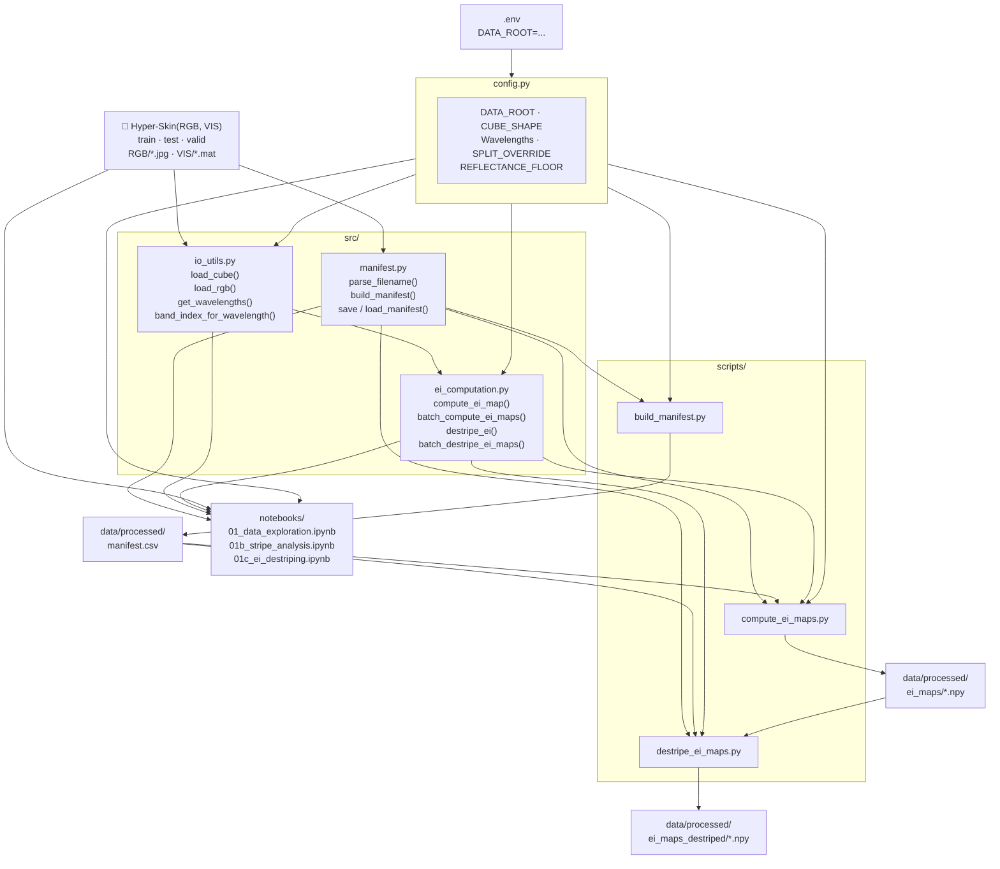

## Estimating Facial Skin Erythema from RGB Images Using Hyperspectral Imaging Data
#### Bachelor Thesis

---

### Project overview

A deep learning pipeline that learns to predict facial erythema index maps from
standard RGB photos, supervised by ground-truth maps derived from co-registered
hyperspectral VIS cubes.

---

### Dataset

The **Hyper-Skin 2023** dataset is the data source used in this project. The RGB-VIS pairs are utilized, spanning 51 subjects across 306 paired hyperspectral cubes and RGB images.

- Splits: train = 44 subjects / 264 images, test = 4 subjects / 24 images, valid = 3 subjects / 18 images.
- **Split override:** subjects p027, p019, p012 are assigned to `test` regardless of their folder, managed via `manifest.csv` (files are not moved).
- Raw cubes: ~124 MB each, ~38 GB total.

```bibtex
@inproceedings{ng2023hyperskin,
  title={Hyper-Skin: A Hyperspectral Dataset for Reconstructing Facial Skin-Spectra from {RGB} Images},
  author={Pai Chet Ng and Zhixiang Chi and Yannick Verdie and Juwei Lu and Konstantinos N Plataniotis},
  booktitle={Thirty-seventh Conference on Neural Information Processing Systems Datasets and Benchmarks Track},
  year={2023},
  url={https://openreview.net/forum?id=doV2nhGm1l}
}
```

---

### Data access and EULA

The Hyper-Skin dataset and all derived data (including erythema index maps) is subject to a dataset EULA (End User 
License Agreement) and **cannot be included in or distributed from this repository**. 
Only 3 of 51 subjects consented to publication use; the EULA restricts storage to signatories only.

**This repository ships code only — no data of any kind.**

Anyone running this pipeline must independently request access:

> **Access request form:** https://hyperskinsiteapp--hyperskinwebapp.asia-east1.hosted.app/dataAccess

After approval you will receive a download link and access password by email. The download is an
archive (`Hyper-Skin.7z`). Once extracted it contains:

```
Hyper-Skin(MSI, NIR)/       
Hyper-Skin(RGB, VIS)/       
    train/
        RGB/    p{xxx}_{facial_pose}_{direction}.jpg
        VIS/    p{xxx}_{facial_pose}_{direction}.mat
    test/
        RGB/    p{xxx}_{facial_pose}_{direction}.jpg
        VIS/    p{xxx}_{facial_pose}_{direction}.mat
    valid/
        RGB/    p{xxx}_{facial_pose}_{direction}.jpg
        VIS/    p{xxx}_{facial_pose}_{direction}.mat
```

Filenames follow `p{xxx}_{facial_pose}_{direction}`: `p{xxx}` = subject (e.g. `p012`),
`{facial_pose}` ∈ {`neutral`, `smile`}, `{direction}` ∈ {`front`, `left`, `right`}. Each RGB
`.jpg` and its paired VIS `.mat` share the same stem (e.g. `p012_neutral_left`).

---

### Stage 1 — Ground-truth EI map computation

**Status:** Implemented. Notebook checks complete.

#### Module structure

```
erythema-estimation/
├── config.py                         # All paths, constants, hyperparameters
├── .env                              # Your local DATA_ROOT (gitignored)
├── .env.example                      # Template — copy to .env and fill in
├── src/
│   ├── manifest.py                   # Build/load dataset manifest CSV
│   ├── io_utils.py                   # Load .mat cubes and .jpg RGB images
│   └── ei_computation.py             # Dawson EI formula + destriping + batch computation
├── scripts/
│   ├── build_manifest.py             # CLI: generate data/processed/manifest.csv
│   ├── compute_ei_maps.py            # CLI: batch-compute all raw EI maps
│   └── destripe_ei_maps.py           # CLI: batch-destripe EI maps (offline, no SSD)
├── notebooks/
│   ├── 01_data_exploration.ipynb     # Sanity-check data before batch run
│   ├── 01b_stripe_analysis.ipynb     # Characterise the push-broom stripe
│   └── 01c_ei_destriping.ipynb       # Validate the destriping method
└── data/
    └── processed/
        ├── manifest.csv              # Generated by build_manifest.py (gitignored)
        ├── ei_maps/                  # Raw EI maps — compute_ei_maps.py (gitignored)
        └── ei_maps_destriped/        # Destriped EI maps — destripe_ei_maps.py (gitignored)
```

#### EI formula

Dawson erythema index (Abdlaty et al. 2021, Eq. 3; Dawson et al. 1980):

```
DEI = 100 × [r + (3/2)(q + s) − 2(p + t)]
```

where p, q, r, s, t = log₁₀(1 / R) at 510, 540, 560, 580, 610 nm respectively.

The five wavelengths correspond to five bands in the hyperspectral cube (31 bands, 400–700 nm, 10 nm step). For each wavelength the reflectance R is read from the cube and converted to log-reciprocal reflectance (absorbance). The formula is applied independently to every pixel, producing a 1024×1024 EI map where each value reflects the erythema at that spatial location. Background pixels yield negative values because their spectral profile does not match the haemoglobin absorption pattern.

#### Destriping

The log-reciprocal transform amplifies the sensor's push-broom stripe into a visible per-column artifact in the EI maps (the RGB images are unaffected and stay raw). Each raw EI map is destriped by **robust column-offset subtraction** (`destripe_ei`): one offset per column, taken from the column median and high-passed with a 100-px median filter, subtracted row-wise. This removes ~84% of the streaking; a faint value-dependent residual remains on the skin but is zero-mean target noise and does not affect the downstream mask (validated in `01b`/`01c`). Destriping runs offline from `ei_maps/` — no hyperspectral cubes needed — and writes a separate `ei_maps_destriped/` artifact (the raw maps are kept for the raw-vs-destriped ablation). The destriped maps are the model target and the input to masking.

---

### Architecture



---

### Setup and quickstart

**1. Request dataset access** at https://hyperskinsiteapp--hyperskinwebapp.asia-east1.hosted.app/dataAccess. After approval you will receive a password by email and `Hyper-Skin.7z` will be shared with your Google account on Google Drive.

**2. Install dependencies**
```bash
pip install -r requirements.txt
brew install p7zip      # macOS — provides the 7z extraction tool
brew install rclone     # macOS — used to download the dataset from Google Drive
```

**3. Set up rclone Google Drive remote (one-time)**

rclone authenticates with your Google account to download the dataset. Run the interactive setup:
```bash
rclone config
```

Follow these steps at the prompts:

| Prompt                  | What to enter |
|-------------------------|---------------|
| New remote              | `n` |
| Name                    | any name, e.g. `gdrive_thesis` — you will use this in `.env` |
| Storage type            | `22` (Google Drive) |
| client_id               | press Enter (leave blank) |
| client_secret           | press Enter (leave blank) |
| scope                   | `2` (read-only) |
| service_account_file    | press Enter (leave blank) |
| Edit advanced config    | `n` |
| Use web browser         | `y` — a browser window opens; log in with the Google account that has dataset access and click Allow |
| Configure as Shared Drive | `n` |
| Keep remote             | `y` |
| Quit                    | `q` |

**4. Configure your environment**
```bash
cp .env.example .env
```

Open `.env` and fill in the values:

| Variable         | Where to find it |
|------------------|------------------|
| `HYPERSKIN_PASS` | Dataset access email — "Dataset Access Password" |
| `RCLONE_REMOTE`  | The name you chose for the rclone remote in step 3 |
| `DATA_ROOT`      | Set after extraction (step 5 prints the correct path) |

**5. Download and extract the dataset**
```bash
caffeinate -di python scripts/extract_dataset.py --output-dir /path/to/destination
```

> **Important:** The archive is ~100 GB and takes longer to download. It cannot be resumed if interrupted. Leave the machine plugged in overnight — `caffeinate -di` prevents macOS from sleeping. On Windows, disable sleep in Power Settings before running.

Once complete, the script prints the correct `DATA_ROOT` value — copy it into `.env`.

**What the script produces:**

```
Google Drive                       local disk (/path/to/destination)
─────────────────                  ──────────────────────────────────────────
Hyper-Skin.7z (~100 GB)            Hyper-Skin(RGB, VIS)/
  ├── Hyper-Skin(RGB, VIS)/   →      ├── train/
  │     ├── RGB/*.jpg                │     ├── RGB/*.jpg   (246 images)
  │     └── VIS/*.mat                │     └── VIS/*.mat   (246 cubes)
  └── Hyper-Skin(MSI, NIR)/          ├── test/
        [skipped — not used]         │     ├── RGB/*.jpg   (42 images)
                                     │     └── VIS/*.mat   (42 cubes)
                                     └── valid/
                                           ├── RGB/*.jpg   (18 images)
                                           └── VIS/*.mat   (18 cubes)
```

**6. Run the pipeline**
```bash
# Build the manifest (creates data/processed/manifest.csv)
python scripts/build_manifest.py

# Batch-compute all raw EI maps (creates data/processed/ei_maps/*.npy)
python scripts/compute_ei_maps.py

# Destripe the EI maps (creates data/processed/ei_maps_destriped/*.npy; runs offline)
python scripts/destripe_ei_maps.py
```

The exploration notebook can be opened before the batch run to sanity-check the data:
```bash
jupyter lab notebooks/01_data_exploration.ipynb
```
